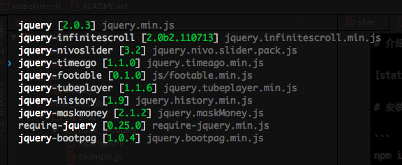

# 介绍

[staticfile.org](http://staticfile.org)命令行工具

# 安装

```
npm install -g sfile
```

# 使用

## 快捷搜索

快速搜索关键字

```
sfile [library]
```



## 搜索

搜索关键字

```
sfile search [library]

Options:
  -s, --ssl      Output HTTPS link
  -h, --html     Output HTML
  -j, --jade     Output Jade Markup
  -n, --no-link  Do not show the link for latest version
```

## 获取链接

获取一个库的所有文件链接

```
sfile get [library]

Options:
  -s, --ssl      Output HTTPS link
  -h, --html     Output HTML
  -j, --jade     Output Jade Markup
  -v, --version  Use given version, leave empty if you want to see all supported version
  -c, --copy     Copy to your system clipboard
```

## 查看版本

```
sfile --version
```
